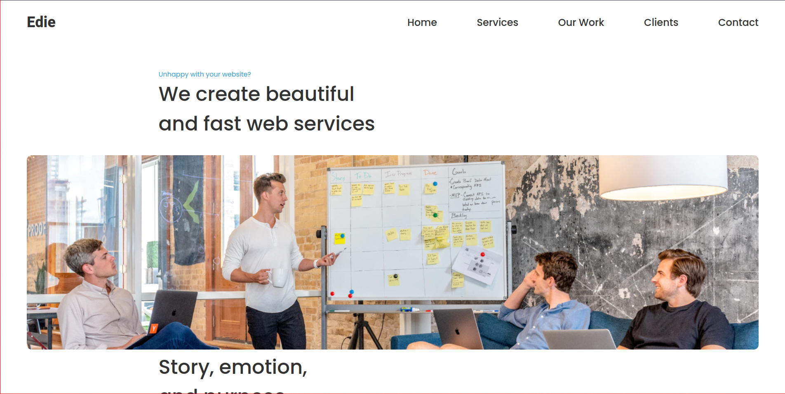

<!-- Please update value in the {}  -->

<h1 align="center">Edie Homepage</h1>

   Solution for a challenge from  <a href="http://devchallenges.io" target="_blank">Devchallenges.io</a>.

  <h3>
    <a href="https://gentle-cobbler-e02337.netlify.app/">
      Demo
    </a>
     | 
    <a href="https://github.com/dXu23/edie-homepage">
      Solution
    </a>
     | 
    <a href="https://devchallenges.io/challenges/xobQBuf8zWWmiYMIAZe0">
      Challenge
    </a>
  </h3>

<!-- TABLE OF CONTENTS -->

## Table of Contents

- [Overview](#overview)
  - [Built With](#built-with)
- [Features](#features)
- [How to use](#how-to-use)
- [Contact](#contact)
- [Acknowledgements](#acknowledgements)

<!-- OVERVIEW -->

## Overview

Introduce your projects by taking a screenshot or a gif. Try to tell visitors a story about your project by answering:

- Where can I see your demo?

Right [here](https://gentle-cobbler-e02337.netlify.app/)

- What was your experience?

Nothing out the usual.

- What have you learned/improved?

I learned some more flexbox and grid.

### Built With

- HTML
- CSS

## Features

This application/site was created as a submission to a [DevChallenges](https://devchallenges.io/challenges) challenge. The [challenge](https://devchallenges.io/challenges/xobQBuf8zWWmiYMIAZe0) was to build an application to complete the given user stories.

- I can see a page following the given design
- I can see a page on mobile following the given design
- I can go to certain locations by selecting links in navigation or footer

## How To Use

Just open index.html in a browser.

## Contact

- [Website](https://rad-sunshine-871fb5.netlify.app/)
- [GitHub](https://github.com/dXu23)
